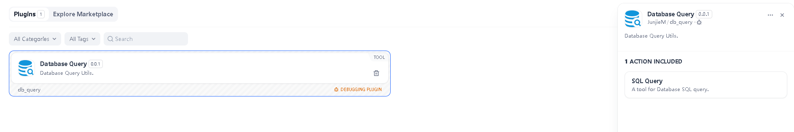
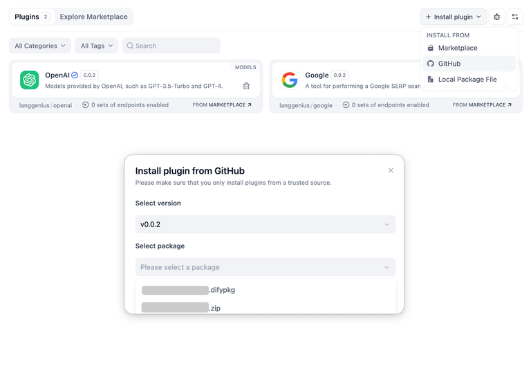

## Dify 1.0 Plugin Database Query Tools

### Demonstration

### Tools

#### Database Query Utils  数据库查询工具

#### Database Query Utils (Pre-authorization)  数据库查询工具（预授权）

### Installing Plugins via GitHub  通过 GitHub 安装插件

Others can install the plugin using the GitHub repository address. Visit the Dify platform's plugin management page, choose to install via GitHub, enter the repository address, select version number and package file to complete installation.

其他人可以通过 GitHub 仓库地址安装该插件。访问 Dify 平台的插件管理页，选择通过 GitHub 安装插件，输入仓库地址后，选择版本号和包文件完成安装。

