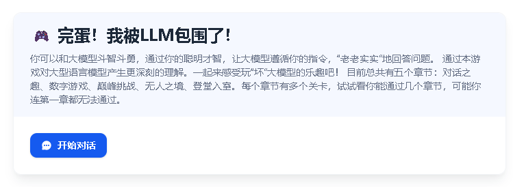
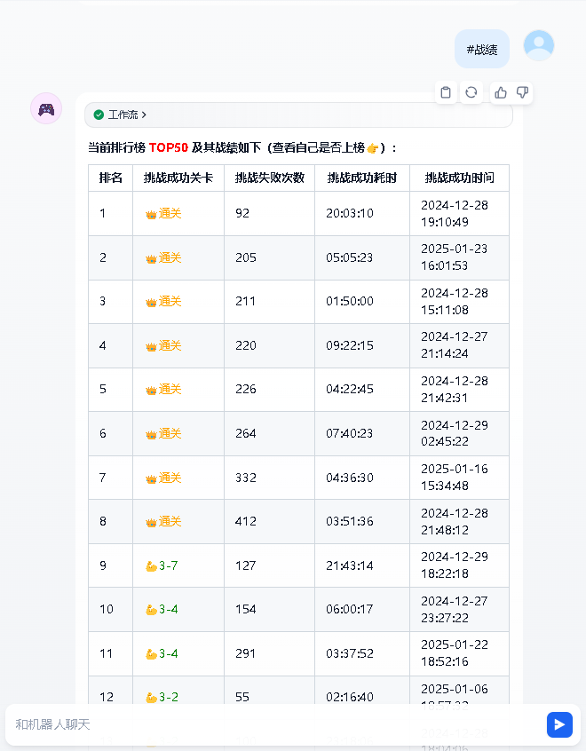

## Dify 1.0 Plugin Database Query Tools


---


### Demonstration


---


### Tools

#### Database Query Utils  数据库查询工具


#### Database Query Utils (Pre-authorization)  数据库查询工具（预授权）


---


### Installing Plugins via GitHub  通过 GitHub 安装插件

Can install the plugin using the GitHub repository address. Visit the Dify platform's plugin management page, choose to install via GitHub, enter the repository address, select version number and package file to complete installation.

可以通过 GitHub 仓库地址安装该插件。访问 Dify 平台的插件管理页，选择通过 GitHub 安装插件，输入仓库地址后，选择版本号和包文件完成安装。


---


### Installing Plugins via Local 通过本地安装插件

If the plugin cannot be installed via GitHub due to network issues, you can [manually download plugin package](https://github.com/junjiem/dify-plugin-tools-dbquery/releases/latest) (`with 'offline' is [true] offline package, without 'offline' installation will with pip connect network to pull the dependency package`).
Visit the Dify platform's plugin management page, choose Local Package File to complete installation.

如果由于网络问题导致无法通过 GitHub 安装插件，可以 [手动下载插件包](https://github.com/junjiem/dify-plugin-tools-dbquery/releases/latest) （`带'offline'的是【真】离线包，不带'offline'的安装时会pip联网拉取依赖包`），访问 Dify 平台的插件管理页，选择通过本地插件完成安装。


---


### FAQ

#### How to Handle Errors When Installing Plugins? 安装插件时遇到异常应如何处理？

**Issue**: If you encounter the error message: plugin verification has been enabled, and the plugin you want to install has a bad signature, how to handle the issue?

**Solution**: Add the following line to the end of your .env configuration file: FORCE_VERIFYING_SIGNATURE=false
Once this field is added, the Dify platform will allow the installation of all plugins that are not listed (and thus not verified) in the Dify Marketplace.

**问题描述**：安装插件时遇到异常信息：plugin verification has been enabled, and the plugin you want to install has a bad signature，应该如何处理？

**解决办法**：在 .env 配置文件的末尾添加 FORCE_VERIFYING_SIGNATURE=false 字段即可解决该问题。
添加该字段后，Dify 平台将允许安装所有未在 Dify Marketplace 上架（审核）的插件，可能存在安全隐患。


---


### Examples 示例

- [完蛋！我被LLM包围了！（Dify1.0战绩排行版）](./examples/完蛋！我被LLM包围了！（Dify1.0战绩排行版）.yml)







---


### Packaging offline package 打离线包

Package Dify plugin [true] offline package (contains dependencies, no need to be connected to the Internet). 

打包Dify插件【真】离线包（包含依赖，不需要再联网）。


#### Dify Plugin Packaging offline package Dify插件打离线包

> ** Note: Here to * * [db_query](https://github.com/junjiem/dify-plugin-tools-dbquery/tree/main/db_query) plugin on CentOS use [Dify Plugin CLI](https://github.com/langgenius/dify-plugin-daemon/releases) to play offline package, for example.

> **注：**这里以 [db_query](https://github.com/junjiem/dify-plugin-tools-dbquery/tree/main/db_query) 插件在 CentOS 上使用 [Dify Plugin CLI](https://github.com/langgenius/dify-plugin-daemon/releases) 打离线包为例。


```shell
cd ./db_query
pip download -r requirements.txt -d ./wheels --index-url https://mirrors.aliyun.com/pypi/simple
sed -i '1i\--no-index --find-links=./wheels/' requirements.txt
sed -i '/^wheels\/$/d' .difyignore # 或直接删除.difyignore文件
cd ..
# dify-plugin-linux-amd64中对插件大小做了最大限制50M（且被写死了），所以我重新编译了dify-plugin-linux-amd64放大限制到500M
dify-plugin-linux-amd64 plugin package ./db_query -o db_query-offline.difypkg # db_query-offline.difypkg 就是最后的（真）离线包
```

!> **提示：** 在Windows或Mac上也可以执行`pip download --platform manylinux2014_x86_64 --only-binary=:all: -r requirements.txt -d ./wheels --index-url https://mirrors.aliyun.com/pypi/simple`


**Dify Plugin CLI 放开最大限制处，如下图：**


#### Update Dify platform env  Dify平台放开限制

- your .env configuration file: Change `FORCE_VERIFYING_SIGNATURE` to `false` , the Dify platform will allow the installation of all plugins that are not listed in the Dify Marketplace. 

- your .env configuration file: Change `PLUGIN_MAX_PACKAGE_SIZE` to `524288000` , and the Dify platform will allow the installation of plug-ins within 500M. 

- your .env configuration file: Change `NGINX_CLIENT_MAX_BODY_SIZE` to `500M` , and the Nginx client will allow uploading content up to 500M in size.  


- 在 .env 配置文件将 `FORCE_VERIFYING_SIGNATURE` 改为 `false` ，Dify 平台将允许安装所有未在 Dify Marketplace 上架（审核）的插件。
- 在 .env 配置文件将 `PLUGIN_MAX_PACKAGE_SIZE` 增大为 `524288000`，Dify 平台将允许安装 500M 大小以内的插件。
- 在 .env 配置文件将 `NGINX_CLIENT_MAX_BODY_SIZE` 增大为 `500M`，Nginx客户端将允许上传 500M 大小以内的内容。


#### Dify Plugin Downloading and Repackaging Scripting Tool  Dify插件下载并重打包脚本工具

Scripting tool for downloading Dify plugin package from Dify Marketplace and Github and repackaging [true] offline package.

从Dify市场和Github下载Dify插件包并重新打【真】离线包的脚本工具。

Github Repo: https://github.com/junjiem/dify-plugin-repackaging

